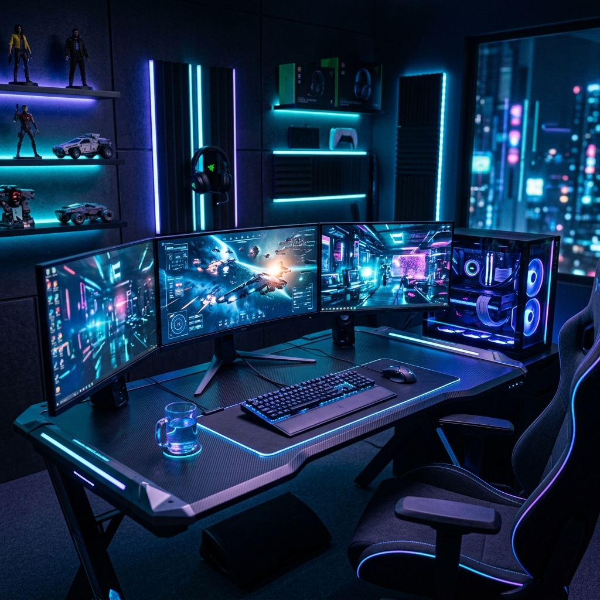

# 🎮 Neon Simon - A Modern Rhythm Challenge

[](https://github.com/amanverma0001/simon-game/stargazers)
[](https://github.com/amanverma0001/simon-game/issues)

**Neon Simon** is a premium, high-fidelity reimagining of the classic Simon memory game. Built with modern web technologies, it features a stunning **Glassmorphism UI**, **Neon Glow** effects, and a realistic cinematic atmosphere.



## ✨ Features

- 🌌 **Modern Aesthetics**: Sleek dark mode with glassmorphism and neon accents.
- ⚡ **Dynamic Feedback**: Responsive animations and a "shake" effect on game over for an immersive experience.
- 📱 **Mobile Ready**: Fully responsive design with touch support for gameplay on any device.
- 🎵 **Rhythmic Gameplay**: Carefully timed sequences to keep you in the zone.
- 🏆 **Score Tracking**: Keep track of your level and push your memory to the limits.

## 🛠️ Technologies Used

- **HTML5**: Semantic structure for better accessibility.
- **CSS3**: Advanced styling including Flexbox, Grid, Glassmorphism, and custom animations.
- **JavaScript (ES6+)**: Core game logic and DOM manipulation.
- **Google Fonts**: Orbitron (Futuristic) and Inter (UI).

## 🚀 How to Play

1. **Launch**: Open `simongame.html` in any modern web browser.
2. **Start**: Press any key (or touch the screen) to begin the first level.
3. **Observe**: Watch the sequence of colors as they flash.
4. **Repeat**: Click the buttons in the exact same order.
5. **Progress**: Each successful round adds a new color to the sequence.
6. **Game Over**: If you click the wrong color, the game ends. Press any key to try again!

## 📂 Project Structure

```text
.
├── background.png      # High-fidelity cinematic background
├── simongame.html      # Main entry point
├── simongame.css       # Premium styles and animations
├── simongame.js        # Core game logic
└── README.md           # Project documentation
```

## 🤝 Contributing

Contributions, issues, and feature requests are welcome! Feel free to check the [issues page](https://github.com/amanverma0001/simon-game/issues).

## 📝 License

This project is [MIT](https://choosealicense.com/licenses/mit/) licensed.

---

Developed with ❤️ by [Aman Verma](https://github.com/amanverma0001)
